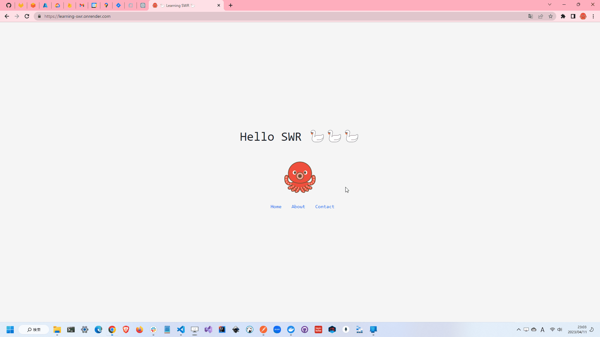

# learning-SWR

🦢🦢🦢 SWR(Next.js/React)とKaminari(Ruby)を使ってページネーションを実装するサンプルです。  

  

## 実行方法

```shell
docker build -t learning-swr .
docker run -d -p 8000:8000 --name learning-swr learning-swr
```

## イロイロ説明

### SWR

SWRはReactのフックを使って、データの取得とキャッシュを行うライブラリです。  
ページネーション機能を簡単に実装でき、またキャッシュコントロームも容易になるため、パフォーマンスの向上にもつながります。  

Next.jsと同じVercelが開発しているため、Next.jsとの相性も良いです。  

`yarn add swr`でインストールします。  

```typescript
import useSWR from 'swr';

const fetcher = url => fetch(url).then(r => r.json())

export default function index() {

  const { data, error, mutate } = useSWR('/api/user', fetcher);

  if (error) return <p>failed to load</p>; // エラー時
  if (!data) return <p>loading...</p>; // ローディング時

  return (
    <div>
      {/* 処理イロイロ */}
    </div>
  );
};
```

### kaminari

ページネーションを実装するためのRubyライブラリです。  
<https://github.com/kaminari/kaminari>  

```shell
bundle add kaminari
```

`kaminari_config.rb`に以下のように記述します。  

```ruby
Kaminari.configure do |config|
  config.default_per_page = 5
end
```
